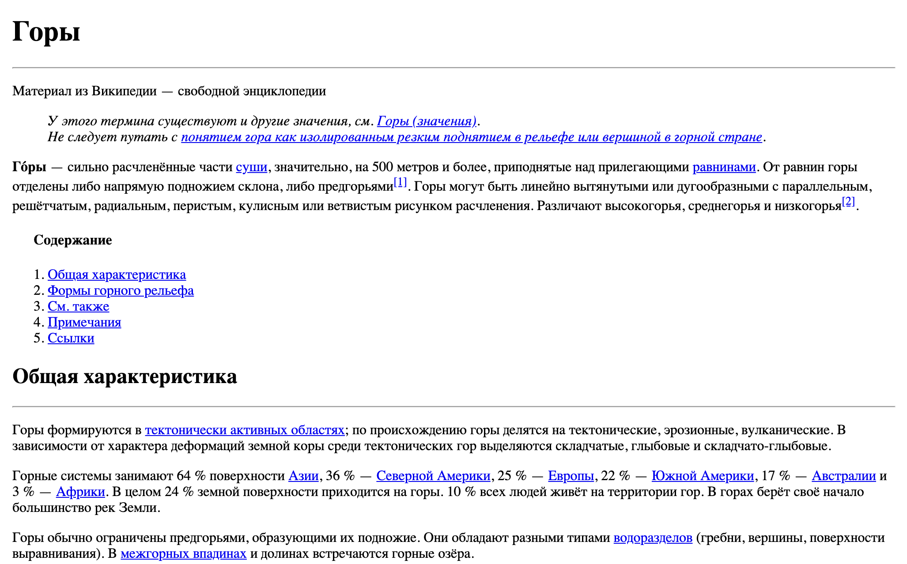

# Меню навигации

Ты много раз сталкивался(-ась) с меню навигации по html-странице. Вспомни, например, Википедию. В начале каждой статьи у тебя есть "содержание", каждый пункт которого является ссылкой на соответствующий раздел. При нажатии на ссылку страница прокручивается до нужного тебе раздела в статье. Скорее всего ты уже догадался(-ась), что тебе предстоит сделать в этом задании — меню навигации по странице! То есть такое же оглавление с ссылками на разделы.

_Для выполнения задания тебе необходимо подробнее изучить работу ссылок `<a>` и познакомиться с так называемыми ["якорями"](https://developer.mozilla.org/ru/docs/Web/HTML/Element/A)._

_Тебе могут пригодиться следующие теги:_

- `
`
- `<blockquote>`
- ` `
- `<strong>`
- `<em>`
- `<ins>`
- `<del>`
- `<cite>`
- ` / `

## Release 0. Структура документа

Работай в файле `index.html`

Возьми любую статью из [Википедии](https://ru.wikipedia.org), где есть `Содержание`. Наполни файл HTML-элементами для заголовков и текстов из выбранной статьи. Сохрани результат.

## Release 1. Меню навигации

Теперь добавь в верхней части html-страницы меню навигации в виде списка, каждый пункт которого соответствует какому либо разделу html-страницы. При нажатии на пункт меню, пользователя должно перекидывать к соответствующему разделу.

## Release 2. Базовая стилизация

Статья уже работает! Однако она пустовата... Добавь стилистические составляющие (жирный / курсивный текст), сноски и ссылки на другие источники, изображениея и таблицы, которые есть в выбранной тобой статье на сайте Википедии.

Всё уже готово? Осталось только сделать `Pull request`.
