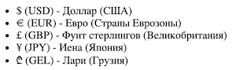
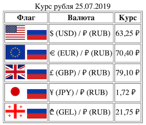

# Таблица

Теперь ты можешь выполнить свою первую практическую задачу c блочными и строчными элементами.
При помощи HTML можно создавать списки, блоки, таблицы, и другие элементы разметки страницы.

Сейчас тебе предстоит освоить работу со списками. С помощью списка можно сделать список задач на день или перечень покупок в супермаркете. Нужно будет сделать перечень валют при помощи ненумерованного списка. Достаточно использовать 4-5 различных валют.
Тебе пригодятся следующие теги: `<ul>`, `<li>`.

Подробнее познакомиться с маркированными списками можно на [MDN](https://developer.mozilla.org/ru/docs/Web/HTML/Element/ul).

Так же тебе предстоит освоить работу с таблицами. Этот элемент применяется достаточно часто. Сверстай таблицу "Курс валют на сегодня". Используй валюты, которые есть в твоём списке. Используй картинки. Тебе пригодятся следующие теги: `<table>`, `<tr>`, `<td>`, ``.

Подробнее познакомиться с таблицами можно на [MDN](https://developer.mozilla.org/en-US/docs/Web/HTML/Element/table).

Работай в файле `index.html`.

Помни: каждый релиз — отдельный коммит (commit)

## Release 0. Список валют

Создай в файле `index.html` ненумерованный список из разных валют.

Пример списка:

## Release 1. Таблица с колонками

Сделай таблицу, в которой будет 2 колонки: валюта, курс на сегодня.

## Release 2. Изображения в таблице

Добавь 3-ю колонку с изображениями флагов стран, валюты которых рассматриваются в соответствующей строке.

Пример таблицы:

## Release 3. Стилизация\*

Задание под звёздочкой, так как мы ещё не доходили до `CSS` кода, но максимально поддерживаем ваше рвение и самостоятельность.
Было бы очень хорошо, чтобы ты разобрался(-лась) как происходит стилизация элементов.
Сделай свою таблицу стильной, тут уже нужно проявить фантазию!

Кстати, информацию по стилизации можно найти на [MDN](https://developer.mozilla.org/ru/docs/Web/HTML/Element/style).

Когда всё сделаешь конечно же делай `Pull Request`!
