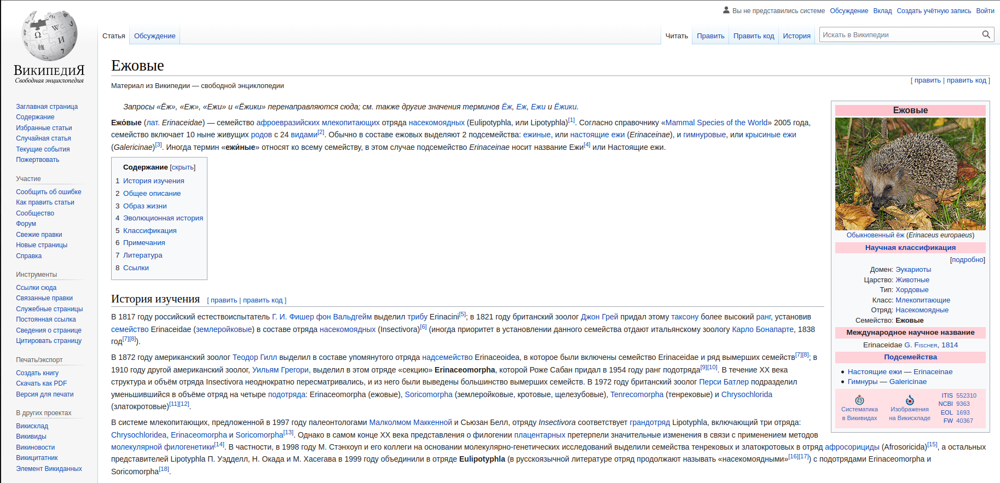

# Ежиная википедия

Твои успехи в верстке меню Википедии не остались незамеченными — к тебе обратилась Международная ассоциация любителей ежей.
Им очень не нравится существующий [раздел Википедии о ежах](https://ru.wikipedia.org/wiki/%D0%95%D0%B6%D0%BE%D0%B2%D1%8B%D0%B5): он скучный, дает мало информации и в нем почти нет замечательных фотографий ежей!

Представитель ассоциации предложил тебе баснословный гонорар за разработку альтернативной страницы, которая более справедливо поведает миру о замечательных созданиях — ежах. Ты, конечно же, согласился.
За работу!

По техническому заданию от клиента, страница должа состоять из:
- Шапки сайта, в которой будет расположен красивый логотип (конечно, с ежом!) и название "Ежиная википедия"
- Блока с навигацией по сайту (ссылки пока могут вести на эту же страницу), расположенный в левой части страницы
- Основного блока контента, расположенного по центру
- Блока с основной фотографией и краткой научной выжимкой о ежах, расположенный в правой части страницы
- "Подвала" страницы (расположен в самом низу страницы) с контактной информацией и ссылкой на тебя, как разработчика 

В основном блоке должно быть как-минимум 4 раздела с заголовками, фотографией и текстом — включи фантазию, постарайся донести до читателей все самое интересное о ежах!

### Release 0. Верстка макета
- Представь свою будущую страницу (можешь нарисовать макет от руки) — какие блоки и где должны быть расположены. Сверяйся с техническим заданием.
- Создай новую html-страницу, используя полученные ранее навыки
- Опиши блоки, используя привычные теги: `
`, `
`, `span` и др.

### Release 1. Добавляем семантику
Еще раз посмотри на техническое задание и свои наброски. Замени теги на более подходящие по смыслу — так твоя страница станет профессиональной и более значимой с точки зрения логики и SEO-продвижения

### Release 2. Содержание
- Добавь названия ссылкам, текст и картинки.
- Статья уже работает! Добавь стилистические составляющие (жирный / курсивный текст), сноски и ссылки на другие источники, изображения и таблицы
- По желанию*: добавь стилизацию с помощью известных свойств CSS

### Release 3. Валидация
Проведи валидацию HTML и CSS (если использован) кода, исправь ошибки, на которые указывает валидатор

Всё уже готово? Осталось только сделать `Pull request`.
